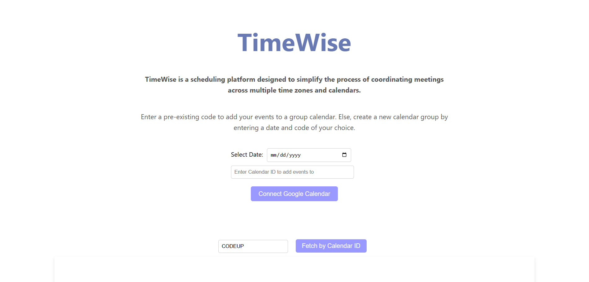
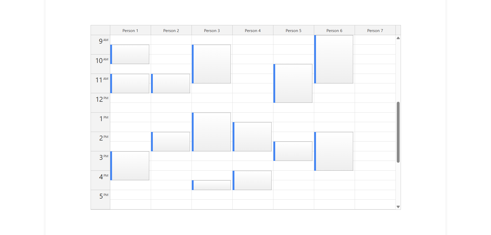

# TimeWise

TimeWise is a scheduling website designed to simplify the process of choosing meeting times compatible with the most participants, while accounting for multiple time zones.




## Description

This website displays a visual representation of overlapping schedules. This allows hosts to assess the optimal or most convenient meeting slots for all participants.

## Getting Started

### 1. Credentials

Before running the backend, create a `.env` file in the root directory and include your **Google Cloud Platform credentials**:

```
REACT_APP_CLIENT_ID=your-google-client-id
REACT_APP_API_KEY=your-google-api-key
```

### 2. Installations

Install the necessary dependencies.
```
cd backend
npm install
cd ../timewise
npm install
```

### 3. Execute Program

In one terminal,
```
cd backend
node server.js
```

In another terminal,
```
cd timewise
npm start
```

This runs the app in the development mode.\
Open [http://localhost:3000](http://localhost:3000) to view it in your browser.

## Acknowledgments

This project was bootstrapped with [Create React App](https://github.com/facebook/create-react-app).
